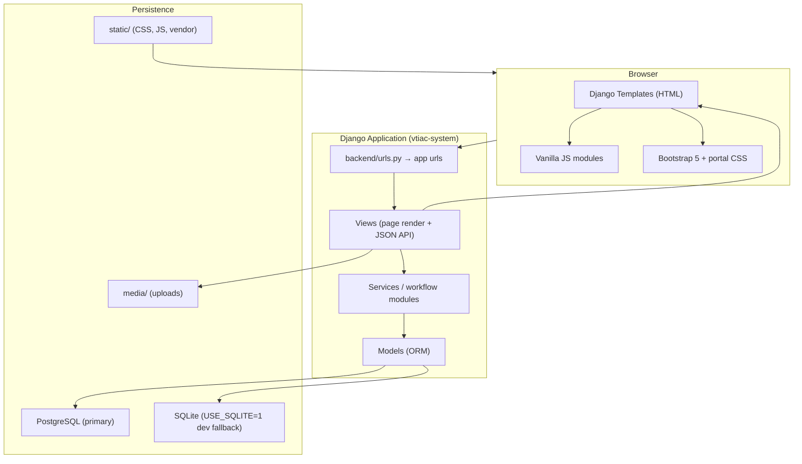
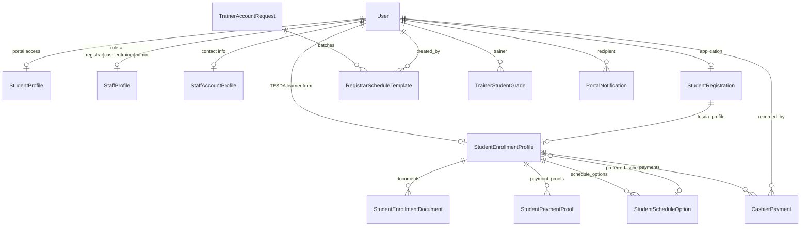

# VTIAC Management System — Architecture Guide

This document explains how the system is structured so you can plan features, trace bugs, and onboard quickly. For setup and installation, see [README.md](./README.md).

---

## Table of Contents

1. [System Overview](#1-system-overview)
2. [High-Level Architecture](#2-high-level-architecture)
3. [Tech Stack](#3-tech-stack)
4. [Directory Layout](#4-directory-layout)
5. [Django Apps (Backend Modules)](#5-django-apps-backend-modules)
6. [Data Model & Relationships](#6-data-model--relationships)
7. [Authentication & Authorization](#7-authentication--authorization)
8. [Student Enrollment Pipeline](#8-student-enrollment-pipeline)
9. [Portal Modules & Routes](#9-portal-modules--routes)
10. [Frontend Architecture](#10-frontend-architecture)
11. [API & Request Patterns](#11-api--request-patterns)
12. [File Storage & Media](#12-file-storage--media)
13. [Configuration & Environment](#13-configuration--environment)
14. [Debugging Cheat Sheet](#14-debugging-cheat-sheet)
15. [Key File Index](#15-key-file-index)

---

## 1. System Overview

**VTIAC Management System** is a multi-portal school operations platform for a TESDA-aligned vocational training institution. It handles:

- Public student registration and enrollment
- Registrar document review, batching, and E.G.A.C.E tracking
- Cashier payment recording and collection reports
- Trainer grading, attendance, and class management
- System admin user management, NC program catalog, and institutional settings

**Architecture style:** Server-rendered **Django monolith** — no SPA framework, no REST framework. HTML is rendered on the server; JavaScript handles form UX, modals, and AJAX calls to JSON endpoints within the same Django app.

**User roles:**

| Role | Login URL | Dashboard |
|------|-----------|-----------|
| Student | `/login/student/` | `/dashboard/student/` |
| Registrar | `/login/registrar/` | `/registrar/dashboard/` |
| Cashier | `/login/cashier/` | `/dashboard/cashier/` |
| Trainer | `/login/trainer/` | `/dashboard/trainer/` |
| System Admin | `/login/admin/` | `/dashboard/admin/` |

Django's built-in admin lives separately at `/admin/` (superuser access).

---

## 2. High-Level Architecture



**Request flow (typical page):**

```
Browser → URL route → View → require_portal_access() → Service layer → Model query
       → Template render → HTML response
```

**Request flow (typical AJAX action):**

```
Browser JS → POST/GET /portal/api/... → View → Service → JsonResponse
           (session cookie + CSRF token)
```

---

## 3. Tech Stack

| Layer | Technology | Notes |
|-------|------------|-------|
| Language | Python 3.12+ | |
| Framework | Django 6.x | Server-rendered, session auth |
| Database | PostgreSQL 16+ | Primary; Docker Compose provided |
| DB fallback | SQLite | Set `USE_SQLITE=1` for local dev without Postgres |
| DB driver | psycopg2-binary | |
| Frontend | Django Templates | No React/Vue/Angular |
| UI | Bootstrap 5 (vendored) | `static/vendor/bootstrap/` |
| Icons | Bootstrap Icons (vendored) | |
| JS | Vanilla ES modules per portal | ~55 files in `static/js/` |
| Excel export | openpyxl | Cashier reports |
| CORS | django-cors-headers | Dev tunnels only |
| Container | Docker Compose | Postgres service only (no app container) |

**Not used:** Django REST Framework, npm/webpack, JWT/OAuth, custom user model.

---

## 4. Directory Layout

```
sheeren-school-system/
└── vtiac-system/                    ← Main application (git repo)
    ├── manage.py                    ← Django CLI entry point
    ├── requirements.txt
    ├── docker-compose.yml           ← PostgreSQL 16 only
    ├── .env.example
    ├── README.md                      ← Setup instructions
    ├── ARCHITECTURE.md                ← This file
    │
    ├── backend/                     ← Django project + all apps
    │   ├── settings.py
    │   ├── urls.py                  ← Root URL router
    │   ├── wsgi.py / asgi.py
    │   ├── core/                    ← Shared infra, notifications, staff profiles
    │   ├── accounts/                ← Login/logout, portal access control
    │   ├── student/                 ← Registration, enrollment, student portal
    │   ├── registrar/               ← Enrollment approval, batching, EGACE
    │   ├── cashier/                 ← Payments, receipts, reports
    │   ├── trainer/                 ← Grading, attendance, class mgmt
    │   └── system_admin/            ← Users, NC programs, system settings
    │
    ├── templates/                   ← Server-side HTML
    │   ├── base.html
    │   ├── landing/
    │   ├── auth/
    │   ├── registration/
    │   ├── student/ registrar/ cashier/ trainer/ admin/
    │   └── components/              ← Reusable partials (sidebars, modals, forms)
    │
    ├── static/
    │   ├── css/main.css
    │   ├── css/modules/             ← Per-portal stylesheets
    │   ├── js/                      ← Per-feature JavaScript
    │   ├── vendor/bootstrap/
    │   ├── data/address/            ← PH region/province/city/barangay JSON
    │   └── img/
    │
    └── media/                       ← Runtime uploads (gitignored)
        └── {student_last_name}/     ← Enrollment docs, photos, receipts
```

---

## 5. Django Apps (Backend Modules)

Each app follows a similar internal pattern:

```
app/
├── models.py          # Database schema
├── views.py           # Page views (or thin re-exports)
├── urls.py            # Route definitions
├── services.py        # Business logic / page context
├── api.py             # JSON endpoints (some apps split into *_api.py)
└── migrations/
```

### `core` — Shared infrastructure

| Responsibility | Key files |
|----------------|-----------|
| Landing page | `core/views.py`, `core/urls.py` |
| Staff profiles | `core/models.py` → `StaffProfile`, `StaffAccountProfile` |
| In-app notifications | `core/models.py` → `PortalNotification` |
| Template context (user display name, role) | `core/context_processors.py` |
| Staff settings API | `core/urls.py` → `/api/staff/settings/` |
| Notification API | `/api/notifications/` |

### `accounts` — Authentication

| Responsibility | Key files |
|----------------|-----------|
| Role-based login/logout | `accounts/views.py`, `accounts/urls.py` |
| Portal access guard | `accounts/services.py` → `require_portal_access()` |
| Session role binding | `request.session["portal_role"]` |
| Seed test staff accounts | `accounts/management/commands/seed_staff_accounts.py` |

### `student` — Student lifecycle

| Responsibility | Key files |
|----------------|-----------|
| Public registration wizard | `student/views.py`, `register-wizard.js` |
| TESDA enrollment profile (Step 1) | `student/enrollment_*.py`, `enrollment_form.html` |
| Document uploads (Step 2) | `student/enrollment_requirements.py`, `student-enrollment-requirements.js` |
| Payment proofs | `student/payments.py`, `student-payments.js` |
| Pipeline state machine | `student/enrollment_workflow.py` |
| Document review helpers | `student/document_review.py` |

### `registrar` — Enrollment operations

| Responsibility | Key files |
|----------------|-----------|
| Module routing & sidebar | `registrar/services.py` → `REGISTRAR_MODULES` |
| Enrollment approval | `registrar/enrollment_api.py` (or similar) |
| Document approve/reject/release | Registrar API endpoints |
| Batching & scheduling | `registrar/batching_api.py`, `registrar/models.py` |
| E.G.A.C.E table | `registrar/egace_api.py` |
| Scholarship registry | `registrar/scholarship_registry.py` |
| Dashboard stats | `registrar/dashboard_stats.py` |
| Batch reconciliation command | `registrar/management/commands/reconcile_batch_schedules.py` |

### `cashier` — Financial operations

| Responsibility | Key files |
|----------------|-----------|
| Student search & fee lookup | `cashier/student_search.py` |
| Payment recording | `cashier/payment_record.py`, `cashier/api.py` |
| Control numbers (`CN-0001`) | Cashier API |
| Excel report export | openpyxl in cashier report views |

### `trainer` — Class & grading

| Responsibility | Key files |
|----------------|-----------|
| Public account request | `/trainer/request/` |
| Grade record sheets | `trainer/services.py`, `trainer/grading` API |
| Attendance printing | `trainer/attendance_print.py` |
| E.G.A.C.E progress derivation | `trainer/egace_progress.py` |

### `system_admin` — System configuration

| Responsibility | Key files |
|----------------|-----------|
| User CRUD (staff + students) | `system_admin/services.py`, `admin-user-management.js` |
| NC program catalog | `system_admin/models.py` → `NcProgram` |
| Global settings (fees, fiscal year, enrollment toggle) | `SystemSettings` singleton |
| Institutional reports | `system_admin/institutional_reports.py` |

---

## 6. Data Model & Relationships

Uses Django's default `auth.User` (email used as login identifier). No custom `AUTH_USER_MODEL`.



### Core entities

| Model | App | Purpose | Key status fields |
|-------|-----|---------|-------------------|
| `StudentProfile` | student | Marks user as student portal member | — |
| `StudentRegistration` | student | Public registration application | `status`: pending / approved / rejected |
| `StudentEnrollmentProfile` | student | TESDA learner profile + workflow flags | `profile_step_completed`, `requirements_submitted`, `documents_review_released`, `photo_registrar_status` |
| `StudentEnrollmentDocument` | student | Uploaded requirements | Per-doc registrar review status |
| `StudentPaymentProof` | student | Student-uploaded payment receipts | — |
| `StudentScheduleOption` | student | Registrar-assigned batch options | — |
| `CashierPayment` | cashier | Official payment records | OR/AR numbers, amounts |
| `RegistrarScheduleTemplate` | registrar | Draft/finalized training batches | draft → finalized |
| `TrainerAccountRequest` | trainer | Public trainer signup requests | pending / approved / rejected |
| `TrainerStudentGrade` | trainer | Unit competency grades (JSON payload) | — |
| `NcProgram` | system_admin | NC program catalog + fees | — |
| `SystemSettings` | system_admin | Singleton global config | `enrollment_open`, fiscal year, registration fee |
| `StaffProfile` | core | Staff role assignment | `role` enum |
| `PortalNotification` | core | In-app alerts | read/unread |

**Model file locations:**

- `backend/core/models.py`
- `backend/student/models.py`
- `backend/registrar/models.py`
- `backend/cashier/models.py`
- `backend/trainer/models.py`
- `backend/system_admin/models.py`

---

## 7. Authentication & Authorization

**File:** `backend/accounts/services.py`

### How login works

1. User visits `/login/<role>/` (student, registrar, cashier, trainer, admin).
2. POST with email + password.
3. Django `authenticate()` using email as username (with email lookup fallback).
4. Role validation:
   - **Student:** must have `StudentProfile`.
   - **Staff:** must have `StaffProfile` with matching `role`.
5. `login(request, user)` + `request.session["portal_role"] = role`.
6. Redirect to role dashboard.

### How access is enforced on every protected view

```python
@login_required(login_url="/")
def my_view(request):
    denied = require_portal_access(request, ROLE)
    if denied:
        return denied  # redirect to login or correct portal
    ...
```

`require_portal_access()` checks:
- User is authenticated
- Session `portal_role` matches the requested role
- Correct profile exists (`StudentProfile` or `StaffProfile`)

### Security notes

- Session-based auth (no JWT)
- CSRF protection on all POST requests (Django middleware)
- JSON endpoints use same session — JS must send CSRF token
- No role elevation: staff cannot access another portal without matching `StaffProfile.role`
- Django admin (`/admin/`) is separate from the custom admin portal (`/dashboard/admin/`)

### Test staff accounts

Seed with:

```powershell
python manage.py seed_staff_accounts
```

Default password: `StaffPass123!`  
Emails: `registrar@vtiac.local`, `cashier@vtiac.local`, `trainer@vtiac.local`, `admin@vtiac.local`

---

## 8. Student Enrollment Pipeline

**Source of truth:** `backend/student/enrollment_workflow.py`

The pipeline has 5 stages shared between the student dashboard stepper and registrar views:

```
┌─────────────┐   ┌──────────────┐   ┌─────────┐   ┌───────────────┐   ┌──────────┐
│ 1. Profile  │ → │ 2. Requirements │ → │ 3. Payment │ → │ 4. Review   │ → │ 5. Enrolled │
│ TESDA form  │   │ Upload docs   │   │ Pay fees  │   │ Registrar OK│   │ Approved   │
└─────────────┘   └──────────────┘   └─────────┘   └───────────────┘   └──────────┘
```

### Stage transition logic (`_active_pipeline_key`)

| Condition | Active stage |
|-----------|--------------|
| Profile incomplete (`profile_step_completed = False`) | `profile` |
| Requirements not submitted | `requirements` |
| Requirements submitted but docs not cleared for payment | `requirements` (shows "Awaiting document approval") |
| Registration status = `approved` | `enrolled` |
| Registration status = `rejected` | `review` |
| Has cashier payment recorded | `review` |
| Requirements submitted, docs cleared, no payment yet | `payment` |

### Document review gate

Before a student can pay, the registrar must approve all documents and **release** them:

- `documents_review_released = True` on `StudentEnrollmentProfile`
- Checked by `documents_cleared_for_payment()` in `student/document_review.py`

### Student-facing URLs per stage

| Stage | URL |
|-------|-----|
| Profile | `/dashboard/student/enrollment/` |
| Requirements | `/dashboard/student/enrollment/requirements/` |
| Payment | `/dashboard/student/payments/` |
| Pending review | `/dashboard/student/enrollment/pending/` |
| Documents archive | `/dashboard/student/documents/` |

### Registrar touchpoints

| Stage | Registrar module | API examples |
|-------|------------------|--------------|
| Document review | Enrollment | `/registrar/api/enrollment/document/approve\|reject\|release/` |
| Enrollment approval | Enrollment | `/registrar/api/enrollment/approve\|reject/` |
| Batching | Batching & Scheduling | `/registrar/api/batching/batches/` |
| E.G.A.C.E | E.G.A.C.E Table | `/registrar/api/egace/employment\|certificate/` |

---

## 9. Portal Modules & Routes

### Root URL configuration

**File:** `backend/urls.py`

All app URLconfs are included at the root level (no `/api/v1` prefix):

```python
path("", include("backend.core.urls")),
path("", include("backend.student.urls")),
path("", include("backend.accounts.urls")),
path("", include("backend.registrar.urls")),
path("", include("backend.cashier.urls")),
path("", include("backend.trainer.urls")),
path("", include("backend.system_admin.urls")),
path("admin/", admin.site.urls),
```

### Registrar modules

Defined in `registrar/services.py` → `REGISTRAR_MODULES`:

| Module slug | URL | Template |
|-------------|-----|----------|
| dashboard | `/registrar/dashboard/` | `registrar/dashboard.html` |
| student | `/registrar/student/` | `registrar/student.html` |
| enrollment | `/registrar/enrollment/` | `registrar/enrollment.html` |
| batching-scheduling | `/registrar/batching-scheduling/` | `registrar/batching_scheduling.html` |
| finalized-batches | `/registrar/finalized-batches/` | `registrar/finalized_batches.html` |
| scholarship | `/registrar/scholarship/` | `registrar/scholarship.html` |
| egace-table | `/registrar/egace-table/` | `registrar/egace_table.html` |
| reports | `/registrar/reports/` | `registrar/reports.html` |
| settings | `/registrar/settings/` | `registrar/settings.html` | 

Cashier, trainer, and admin portals follow the same `<portal>/<module>/` pattern.

### Shared APIs (all roles)

| Endpoint | Purpose |
|----------|---------|
| `/api/notifications/` | List portal notifications |
| `/api/notifications/<id>/read/` | Mark one read |
| `/api/notifications/mark-all-read/` | Mark all read |
| `/api/staff/settings/profile/` | Staff profile update |
| `/api/staff/settings/password/` | Staff password change |

---

## 10. Frontend Architecture

### Template composition

Every portal page follows this pattern:

```
templates/
├── base.html                          ← Bootstrap, global scripts
├── components/{portal}/
│   ├── layout_start.html              ← Opens layout, includes sidebar
│   ├── layout_end.html                ← Closes layout
│   ├── sidebar_desktop.html
│   └── sidebar_mobile.html
└── {portal}/{page}.html               ← Page content between layout_start/end
```

`base.html` loads shared JS (`staff-common.js`, `portal-notifications.js`, `logout-confirm.js`).

Each page loads its own feature JS at the bottom of the template.

### JavaScript organization

JS is **not bundled** — each feature is a standalone file loaded via `<script src="...">`.

| Category | Files | Purpose |
|----------|-------|---------|
| Shared | `staff-common.js`, `address-cascade.js`, `file-upload-preview.js`, `portal-notifications.js` | Cross-portal utilities |
| Student | `register-wizard.js`, `student-enrollment.js`, `student-enrollment-requirements.js`, `student-payments.js` | Registration & enrollment UX |
| Registrar | `registrar-enrollment.js`, `registrar-batching.js`, `registrar-egace-table.js`, `registrar-scholarship.js` | Registrar operations |
| Cashier | `cashier-payment.js`, `cashier-students.js`, `cashier-reports.js` | Payment & reporting |
| Trainer | `trainer-grading.js`, `trainer-sheets.js`, `trainer-students.js` | Class management |
| Admin | `admin-user-management.js`, `admin-system-settings.js`, `admin-reports.js` | System config |

### CSS organization

- `static/css/main.css` — global styles
- `static/css/modules/{portal}.css` — portal-specific overrides

### Address cascade

Philippine address fields use static JSON in `static/data/address/`:
- `region.json`, `province.json`, `city.json`, `barangay.json`
- Driven by `address-cascade.js`

---

## 11. API & Request Patterns

There is no formal API layer. JSON endpoints are regular Django views returning `JsonResponse`.

### Typical AJAX call pattern (from JS)

```javascript
fetch("/registrar/api/enrollment/approve/", {
    method: "POST",
    headers: {
        "Content-Type": "application/json",
        "X-CSRFToken": getCsrfToken(),  // from cookie or meta tag
    },
    body: JSON.stringify({ profile_id: "..." }),
})
```

### Conventions

- Staff APIs prefixed with portal name: `/registrar/api/...`, `/cashier/api/...`
- Student APIs under `/dashboard/student/api/...`
- Admin APIs under `/admin/api/...`
- Shared APIs under `/api/...`
- All require authenticated session + correct `portal_role`
- POST endpoints require valid CSRF token

### When adding a new feature

1. Add route in app's `urls.py`
2. Add view (page render or JSON handler)
3. Put business logic in `services.py` or a dedicated module (e.g. `batching_api.py`)
4. Add template + JS file
5. Wire JS in template with `<script src="">`

---

## 12. File Storage & Media

| Setting | Value |
|---------|-------|
| `MEDIA_ROOT` | `vtiac-system/media/` |
| `MEDIA_URL` | `/media/` |
| Served in DEBUG | Yes, via `urls.py` static helper |

### Upload path convention

Enrollment files are stored under a folder named from the student's last name:

```
media/
└── Dela_Cruz/
    ├── birth_certificate.pdf
    ├── valid_id.jpg
    └── photo_2x2.jpg
```

Upload path logic: `student/models.py` → `enrollment_photo_upload_to()`, `_enrollment_media_folder()`.

Document types (enum in `StudentEnrollmentDocument.DocumentType`):
- `birth_certificate`, `valid_id`, `photo_2x2`, `good_moral`, `transcript`

---

## 13. Configuration & Environment

**Settings file:** `backend/settings.py`

| Variable | Default | Purpose |
|----------|---------|---------|
| `USE_SQLITE` | off | Use SQLite instead of Postgres |
| `POSTGRES_DB` | `vtiac` | Database name |
| `POSTGRES_USER` | `postgres` | DB user |
| `POSTGRES_PASSWORD` | (see settings) | DB password |
| `POSTGRES_HOST` | `localhost` | DB host |
| `POSTGRES_PORT` | `5432` | DB port |

**Important dev settings:**

- `DEBUG = True` (change before production)
- `ALLOWED_HOSTS` includes localhost and dev tunnel domains
- `LOGIN_URL = "/login/student/"`
- `CORS_ALLOWED_ORIGINS` for dev tunnels

**Docker Compose:** starts PostgreSQL 16 only — the Django app runs directly via `manage.py runserver`.

---

## 14. Debugging Cheat Sheet

Use this table to find where to look when something breaks.

### "Student stuck on wrong enrollment step"

| Check | File |
|-------|------|
| Pipeline stage logic | `backend/student/enrollment_workflow.py` → `_active_pipeline_key()` |
| Profile flags | DB: `StudentEnrollmentProfile.profile_step_completed`, `requirements_submitted`, `documents_review_released` |
| Document review state | `backend/student/document_review.py` |
| Payment recorded? | `backend/student/payment_records.py` → `profile_has_payment()` |
| Registration status | `StudentRegistration.status` |

### "Document upload / requirements page issue"

| Check | File |
|-------|------|
| Backend requirements logic | `backend/student/enrollment_requirements.py` |
| Frontend upload UX | `static/js/student-enrollment-requirements.js` |
| Template | `templates/components/student/enrollment_requirements_list.html` |
| Document model & statuses | `backend/student/models.py` → `StudentEnrollmentDocument` |

### "Registrar can't approve enrollment"

| Check | File |
|-------|------|
| Enrollment API | `backend/registrar/` → enrollment API module |
| Frontend | `static/js/registrar-enrollment.js` |
| Payment prerequisite | Cashier must record payment first |
| Document release flag | `documents_review_released` must be `True` |

### "Batching / schedule not showing students"

| Check | File |
|-------|------|
| Batching API | `backend/registrar/batching_api.py` |
| Student pool logic | `backend/registrar/batching_student_pool.py` |
| Schedule sync | `backend/registrar/batch_schedule_sync.py` |
| Reconciliation command | `python manage.py reconcile_batch_schedules` |
| Frontend | `static/js/registrar-batching.js` |

### "Payment not reflecting"

| Check | File |
|-------|------|
| Payment recording | `backend/cashier/payment_record.py` |
| Cashier API | `backend/cashier/api.py` |
| Student payment view | `backend/student/payments.py` |
| Frontend | `static/js/cashier-payment.js`, `static/js/student-payments.js` |

### "Login redirects wrong portal"

| Check | File |
|-------|------|
| Access control | `backend/accounts/services.py` → `require_portal_access()` |
| Session role | Browser devtools → Application → Cookies → session |
| Profile mismatch | DB: `StaffProfile.role` vs URL role |

### "Notifications not appearing"

| Check | File |
|-------|------|
| Notification creation | Search codebase for `PortalNotification.objects.create` |
| API | `backend/core/` notification views |
| Frontend polling/render | `static/js/portal-notifications.js` |

### Useful Django commands

```powershell
# Run server
python manage.py runserver

# Apply migrations
python manage.py migrate

# Create migrations after model changes
python manage.py makemigrations

# Seed test staff
python manage.py seed_staff_accounts

# Reconcile batch schedules
python manage.py reconcile_batch_schedules

# Django shell for inspecting data
python manage.py shell
```

### Django shell quick queries

```python
from django.contrib.auth import get_user_model
from backend.student.models import StudentEnrollmentProfile, StudentRegistration

User = get_user_model()
user = User.objects.get(email="student@example.com")
profile = user.enrollment_profile
reg = user.registration_application

print(profile.requirements_submitted, profile.documents_review_released)
print(reg.status if reg else "no registration")
```

---

## 15. Key File Index

### Entry points

| File | Role |
|------|------|
| `manage.py` | Django CLI |
| `backend/settings.py` | All configuration |
| `backend/urls.py` | Root URL router |

### Auth

| File | Role |
|------|------|
| `backend/accounts/services.py` | Login, logout, `require_portal_access()` |
| `backend/accounts/urls.py` | `/login/<role>/`, `/logout/` |

### Enrollment workflow

| File | Role |
|------|------|
| `backend/student/enrollment_workflow.py` | Pipeline stage machine |
| `backend/student/document_review.py` | Document approval gates |
| `backend/student/enrollment_requirements.py` | Requirements upload handling |
| `backend/student/payments.py` | Student payment page logic |
| `backend/student/payment_records.py` | Payment existence checks |

### Registrar

| File | Role |
|------|------|
| `backend/registrar/services.py` | Module definitions & page context |
| `backend/registrar/batching_api.py` | Batch CRUD API |
| `backend/registrar/egace_api.py` | E.G.A.C.E flags |
| `backend/registrar/models.py` | `RegistrarScheduleTemplate` |

### Cashier

| File | Role |
|------|------|
| `backend/cashier/api.py` | All cashier JSON endpoints |
| `backend/cashier/payment_record.py` | Payment creation logic |
| `backend/cashier/student_search.py` | Student lookup |

### Templates (most reused)

| File | Role |
|------|------|
| `templates/base.html` | Root HTML layout |
| `templates/components/student/enrollment_form.html` | TESDA learner form |
| `templates/components/student/enrollment_requirements_list.html` | Document upload UI |
| `templates/registration/register.html` | Public registration wizard |

---

## E.G.A.C.E Tracking (Cross-Portal)

**E.G.A.C.E** = Enrolled → Graduate → Assessment → Certificate → Employment

| Milestone | Set by | Source |
|-----------|--------|--------|
| Enrolled | Registrar | `StudentRegistration.status = approved` |
| Graduate | Trainer | Grades in `TrainerStudentGrade` |
| Assessment | Trainer | Grades / competency records |
| Certificate | Derived | Trainer grades (not manual registrar flag) |
| Employment | Registrar | `StudentRegistration.egace_employment` flag via API |

Tracked in:
- Registrar: `/registrar/egace-table/` + `registrar-egace-table.js`
- Trainer: reports + `trainer-egace-store.js`
- Admin: institutional E.G.A.C.E reports

---

## Production Checklist

Before deploying publicly:

- [ ] Set `DEBUG = False`
- [ ] Move `SECRET_KEY` to environment variable
- [ ] Configure `ALLOWED_HOSTS` properly
- [ ] Use managed PostgreSQL (not Docker Compose defaults)
- [ ] Run `collectstatic` and serve via CDN/reverse proxy
- [ ] Configure proper media storage (S3 or persistent volume)
- [ ] Remove or rotate hardcoded credentials in `settings.py`

---

*Last updated: July 2026 — reflects Django 6.x monolith structure in `vtiac-system/`.*
